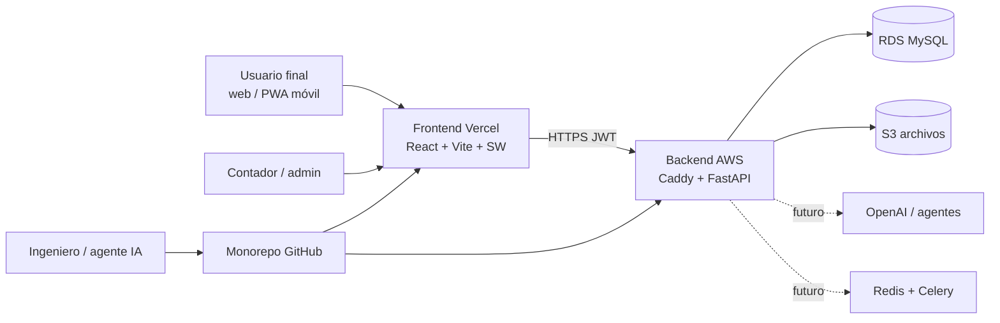
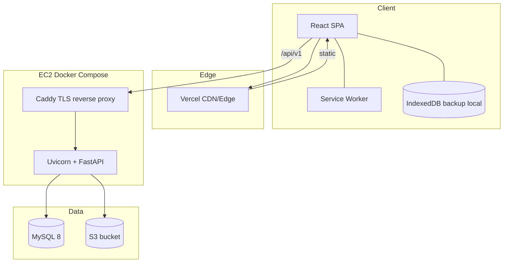
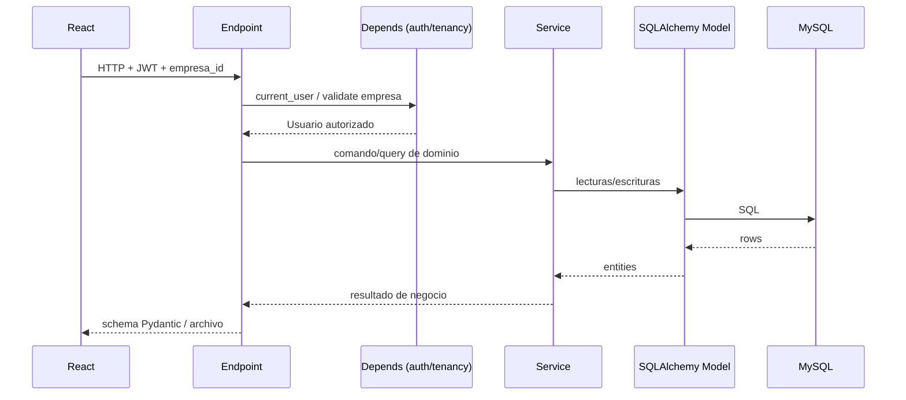
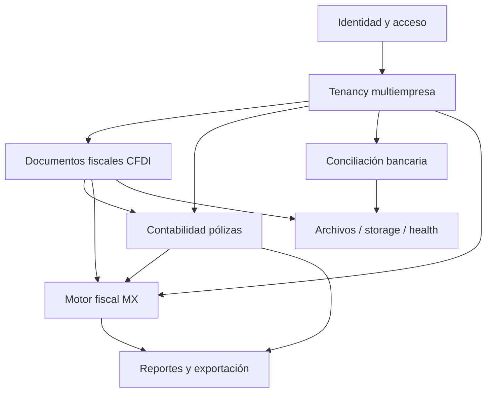
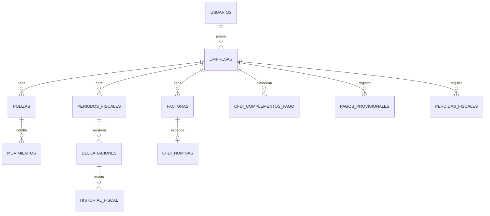
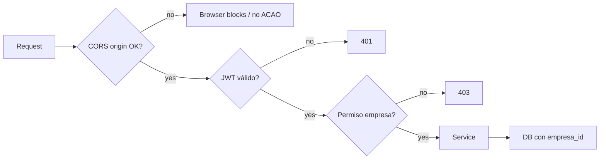

# Arquitectura detallada — SmartContable como esqueleto de plataforma

**Versión del documento:** 2026-10-01  
**Estado:** canónico para clonación / nuevos productos  
**Complemento:** [REPORTE_TECNICO_DETALLADO_2026-10-01_ESQUELETO_PLATAFORMA.md](../REPORTE_TECNICO_DETALLADO_2026-10-01_ESQUELETO_PLATAFORMA.md)

---

## 1. Intención arquitectónica

SmartContable no se diseña solo como “app contable”, sino como **plantilla de SaaS multi-tenant** con:

- API versionada y delgada
- dominio en servicios
- persistencia ORM + migraciones
- frontend SPA/PWA desacoplado
- despliegue reproducible
- aislamiento por empresa
- bitácora técnica de evolución

Cualquier proyecto nuevo debería poder:

1. copiar el armazón,
2. sustituir bounded contexts,
3. mantener las mismas garantías operativas.

---

## 2. Principios (no negociables)

| # | Principio | Implicación práctica |
|---|---|---|
| 1 | Separación de capas | Endpoint ≠ negocio ≠ SQL ad-hoc sin control |
| 2 | Multiempresa primero | Casi toda entidad de negocio lleva `empresa_id` |
| 3 | Schema solo por migraciones | Alembic es la fuente de verdad en prod |
| 4 | Secretos fuera del repo | `.env` / SSM / secret managers |
| 5 | API versionada | Prefijo `/api/v1` |
| 6 | Fallar seguro | Handlers de error, health/ready, DEBUG off en prod |
| 7 | Cliente delgado | React orquesta UI; backend decide reglas |
| 8 | Observabilidad mínima | Logs + liveness + readiness desde el día 1 |
| 9 | PWA consciente | Cache de shell, nunca de datos sensibles de API |
| 10 | Documentar el cambio | Reportes técnicos por entrega relevante |

Fuente normativa del día a día: raíz [`AGENTS.md`](../AGENTS.md).

---

## 3. Vista contextual (C4-L1)



### Actores

- **Usuario de negocio:** captura CFDI, revisa pólizas, fiscal, reportes.
- **Contador/revisor:** aprueba módulos, exporta DIOT, bitácora.
- **Operador técnico:** deploy, migraciones, health.
- **Agente de código:** respeta `AGENTS.md` y capas.

---

## 4. Vista de contenedores (C4-L2)



### Contratos entre contenedores

| De → A | Protocolo | Contrato |
|---|---|---|
| SPA → API | HTTPS JSON | REST `/api/v1/*`, Bearer JWT |
| API → MySQL | SQL via SQLAlchemy | Modelos + Alembic |
| API → S3 | AWS SDK | Keys por archivo/empresa |
| SPA → IndexedDB | Browser API | Snapshots offline / backup device |
| SW → SPA assets | Cache API | App shell versionada |

---

## 5. Vista de componentes backend (C4-L3)

```text
app/
├── main.py                 # composition root HTTP
├── api/v1/
│   ├── router.py           # agrega bounded contexts
│   └── endpoints/*         # adaptadores de entrada
├── schemas/                # DTOs Pydantic (in/out)
├── services/               # casos de uso / reglas
├── models/                 # entidades ORM
├── core/                   # cross-cutting
│   ├── config.py
│   ├── database.py
│   ├── security.py
│   ├── dependencies.py
│   ├── permissions.py
│   ├── tenancy_validators.py
│   ├── exceptions.py
│   └── logging_config.py
├── ai/                     # futuro: agentes/prompts/tools
└── tasks/                  # futuro: jobs async
```

### Flujo de un request típico



### Regla de oro del endpoint

1. Recibir  
2. Validar (Pydantic + Depends)  
3. Delegar a service  
4. Responder  

Prohibido: reglas fiscales/contables largas dentro del router.

---

## 6. Mapa de bounded contexts actuales

Estos contextos son el **dominio SmartContable**. En un fork, se sustituyen; la forma se conserva.



| Context | Routers | Services clave | Models clave |
|---|---|---|---|
| IAM | `/auth` | security core | `usuario` |
| Tenancy | `/empresas` | empresas + validators | `empresa` |
| CFDI | `/facturas`, `/cfdi-complementos` | `sat_parser`, `cfdi_complementos` | `factura`, complementos |
| Contabilidad | `/polizas`, `/configuracion` | `polizas`, mapeos | `poliza`, `mapeo_cuenta` |
| Banco | `/conciliacion` | `conciliacion`, `bank_parser` | movimientos banco |
| Fiscal | `/fiscal` | `calculos_fiscales`, `diot`, historial, indicadores | periodos, declaraciones, ajustes |
| Reportes | `/reportes` | `informes_contables`, export | lecturas agregadas |
| Ops | `/health`, `/ready` | storage, logging | — |

---

## 7. Modelo de multi-tenancy

### 7.1 Estrategia

**Shared database, shared schema, discriminator `empresa_id`.**

Ventajas beta: simple, barato, Alembic único.  
Riesgo: fugas de datos si un query olvida el filtro → mitigar con validators y tests.

### 7.2 Reglas

1. Toda entidad de negocio relevante incluye `empresa_id`.
2. Toda operación valida que el usuario puede operar esa empresa.
3. Nunca devolver filas de otra empresa “por conveniencia”.
4. Índices por `empresa_id` en tablas calientes.
5. Unique constraints compuestos cuando el natural key es por tenant (ej. UUID CFDI por empresa).

### 7.3 Punto de extensión para proyectos nuevos

Si el nuevo SaaS necesita isolation fuerte (salud, legal, finanzas reguladas):

- Fase 1: mismo patrón `empresa_id`
- Fase 2: schema-per-tenant o DB-per-tenant
- Sin reescribir la API si los services ya reciben `empresa_id` explícito

---

## 8. Modelo de datos (vista lógica)



### Decisiones de diseño

| Decisión | Motivo |
|---|---|
| UUID CFDI como id fiscal de negocio | Estándar SAT; idempotencia de carga |
| Declaraciones versionadas + vigente | Auditoría y correcciones sin borrar historia |
| `historial_fiscal` genérico | Bitácora multi-entidad (export, revisión contable, etc.) |
| Pagos provisionales / pérdidas tablas propias | Ajustes manuales del contador sin contaminar CFDI |
| Complementos en tablas separadas de `facturas` | CFDI de pago/nómina tienen shape distinto |
| S3 keys en entidades de archivo | Origen reconstruible sin guardar blob en MySQL |

### Evolución del schema

Cadena Alembic lineal hasta head `d3e4f5a6b7c8` (ver reporte técnico).  
Política: una migración por capacidad desplegable; never edit applied migrations in prod.

---

## 9. Arquitectura frontend

### 9.1 Capas UI

```text
pages/          rutas y composición de pantalla
components/     paneles de bounded context
services/       HTTP + backup local
utils/          helpers puros
public/         PWA assets
```

### 9.2 Patrón de composición (Company hub)

`CompanyDetail` actúa como **shell multi-tab** por empresa:

- carga contexto `empresa_id`
- monta paneles (`FiscalConsolidadosPanel`, pólizas, conciliación, …)
- no debería acumular toda la lógica de dominio (extraer paneles)

### 9.3 Estado

- Auth token en `localStorage` (simple beta; mejorar a storage seguro / refresh tokens en madurez).
- Server state vía Axios ad-hoc (sin React Query aún).
- Offline/respaldo: IndexedDB (`backupCore` / `localBackup`).

### 9.4 PWA

```text
install → cache APP_SHELL versionada
activate → borra caches smartcontable-app-* viejas
fetch navigate → network first, fallback index.html
fetch static → network + put cache
fetch /api → bypass SW
```

Bump de `APP_VERSION` = contrato de release móvil.

---

## 10. Seguridad arquitectura



Controles:

- Hash de passwords
- JWT HS256 con expiración configurable
- Validación de settings al boot
- Handlers que no filtran SQL en producción
- Uploads con límites de tamaño/cantidad
- Secrets en SSM en AWS

Mejoras futuras del esqueleto:

- refresh tokens / rotación
- RBAC fino por rol (hoy más coarse)
- rate limit edge (slowapi ya en deps)
- auditoría de acceso cross-tenant automatizada

---

## 11. Despliegue y ambientes

| Ambiente | Frontend | Backend | DB |
|---|---|---|---|
| Local dev | Vite `:5173` | Uvicorn `:8000` | MySQL local / compose |
| Beta prod | Vercel | EC2 + Caddy + Docker | RDS MySQL |
| Futuro | CDN | ECS/ACA/AKS | RDS / Aurora / flexible |

### Pipeline mental de release

```text
code → pytest críticos → npm build → git push
     → Vercel auto FE
     → zip backend → S3 → SSM compose up --build
         → alembic upgrade head
         → health/ready
         → verify tables script
```

### Por qué el CMD del contenedor importa

`alembic upgrade head && uvicorn` convierte el deploy en **migración+release atómicos a nivel de arranque**.  
Si la migración falla, el servicio no debería quedar sirviendo código nuevo sobre schema viejo.

---

## 12. Testing strategy del esqueleto

Prioridad (alineada a `AGENTS.md`):

1. **Services** (reglas de negocio)  
2. **Repositories/queries** (cuando existan)  
3. **Endpoints** (contratos HTTP)  
4. Frontend (aún deuda)

Patrones ya presentes:

- tests de parsers (banco, SAT)
- tests de cálculos fiscales
- tests de health/pool
- tests de upload limits
- tests de indicadores/diferencias

Al clonar: crear `tests/test_<contexto>.py` por cada service nuevo **antes** de UI compleja.

---

## 13. Extensibilidad: IA y async

### IA (`app/ai/`)

Diseño previsto:

```text
ai/
  agents/
  prompts/     # prompts como archivos, no hardcode eternos
  services/
  tools/
  embeddings/
```

Regla: la IA **no vive en endpoints**. El endpoint llama un application service que orquesta el agente.

### Async (`tasks/` + Celery/Redis)

Usar cuando:

- parseo masivo ZIP
- conciliaciones largas
- generación de paquetes fiscales
- sync SAT

No bloquear request/response HTTP para jobs > pocos segundos.

---

## 14. Guía para clonar la arquitectura en un proyecto nuevo

### 14.1 Plantilla de decisión

| Pregunta | Si sí | Si no |
|---|---|---|
| ¿SaaS multi-cliente? | Copia tenancy completo | Simplifica a single-tenant pero deja `owner_id` |
| ¿Archivos de usuario? | Copia `file_storage` + S3 flag | Solo DB |
| ¿Mobile first? | Copia PWA + version bump ritual | SPA normal |
| ¿Reglas de negocio fuertes? | Services + tests primero | CRUD schemas bastan al inicio |
| ¿Compliance/auditoría? | Bitácora estilo `historial_*` | logs basicos |

### 14.2 Esqueleto mínimo viable (MVP técnico)

Backend:

1. `main.py` + CORS + handlers + `/health` `/ready`
2. `core/{config,database,security,dependencies,exceptions}`
3. `models/usuario` (+ tenant si aplica)
4. 1 router CRUD + 1 service + 1 schema
5. Alembic initial
6. Dockerfile con migrate-on-start
7. 3 tests (auth, health, service)

Frontend:

1. Vite React Tailwind
2. Login + Home
3. `api.js` con JWT interceptor
4. 1 página de recurso
5. env `VITE_API_URL`

Ops:

1. compose local
2. un host prod
3. README + AGENTS.md + primer reporte técnico

### 14.3 Mapa de renombres sugerido

| SmartContable | Genérico |
|---|---|
| `empresa_id` | `tenant_id` (o conservar empresa si B2B LATAM) |
| `factura` | `document` / `invoice` |
| `poliza` | quitar o mapear a ledger del nuevo dominio |
| `fiscal_*` | `billing_*` / `compliance_*` / etc. |
| `smartcontable-app-` cache | `{product}-app-` |

---

## 15. Deudas arquitectónicas conocidas (honestas)

1. **Repository layer** declarada, implementación uneven → objetivo: mover queries complejas fuera de services gordos.
2. **CompanyDetail** y algunos paneles aún densos → seguir extrayendo hooks/services FE.
3. **Sin API gateway** ni rate limit edge en beta.
4. **Observability**: no hay tracing distribuido / App Insights / OTel completo.
5. **Frontend test harness** casi ausente.
6. **RBAC** por roles de despacho aún simple.
7. **Event-driven** interno no existe (todo request/response); para escala, outbox + cola.
8. Inconsistencia `created_at` vs `creado_en`.

Estas deudas **no impiden** usar el repo como esqueleto; deben entrar al backlog del producto nuevo según criticidad.

---

## 16. Criterios de aceptación arquitectónica (Definition of Done de plataforma)

Un cambio “respeta el esqueleto” si:

- [ ] No mete negocio en endpoint ni en JSX denso sin service/panel
- [ ] Respeta `empresa_id` / auth
- [ ] Trae migración Alembic si toca schema
- [ ] Tiene test de service para regla crítica
- [ ] No rompe `/health` `/ready`
- [ ] No introduce secretos al git
- [ ] Si es release móvil, bump `APP_VERSION`
- [ ] Actualiza roadmap o reporte técnico cuando el cambio es de etapa

---

## 17. Diagrama resumen “qué es el esqueleto”

```text
                    ┌──────────────────────────────────────┐
                    │         ESQUELETO PLATAFORMA         │
                    │  auth · tenancy · api v1 · settings  │
                    │  alembic · docker migrate · health   │
                    │  pwa version · axios jwt · reports   │
                    └──────────────────────────────────────┘
                                      │
              ┌───────────────────────┼───────────────────────┐
              ▼                       ▼                       ▼
     Dominio SmartContable    Dominio Proyecto B      Dominio Proyecto C
     CFDI·pólizas·fiscal      (tu idea)               (tu idea)
```

**Conservar el rectángulo superior. Intercambiar el inferior.**

---

## 18. Referencias internas

- [`AGENTS.md`](../AGENTS.md)
- [`docs/ROADMAP.md`](ROADMAP.md)
- [`docs/DATABASE.md`](DATABASE.md)
- [`docs/API_REFERENCE.md`](API_REFERENCE.md)
- [`docs/REPORTE_TECNICO_DEPLOYMENT_VERCEL_AWS.md`](REPORTE_TECNICO_DEPLOYMENT_VERCEL_AWS.md)
- [`docs/TECHNOLOGY_STACK_ENGINEERING_REPORT.md`](TECHNOLOGY_STACK_ENGINEERING_REPORT.md)
- Código: `backend/app/main.py`, `backend/app/api/v1/router.py`, `frontend/src/services/api.js`, `frontend/public/sw.js`

---

## 19. Cierre

Esta arquitectura está lista para ser **parteaguas**: no porque el dominio fiscal esté “terminado para siempre”, sino porque el sistema ya impone una forma de crecer (capas, tenant, migraciones, release, documentación) que se puede repetir en los proyectos que tienes en mente.

El siguiente paso natural al clonar no es copiar DIOT: es **definir el bounded context #1 del producto nuevo** y montarlo sobre este armazón con una migración limpia y un panel React delgado.
